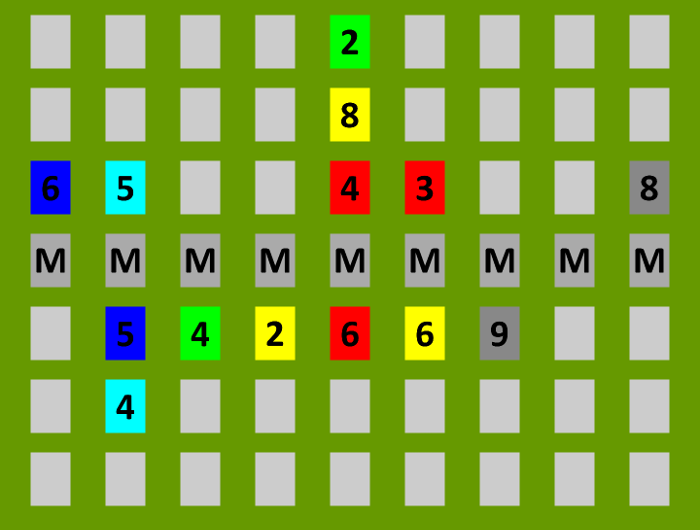
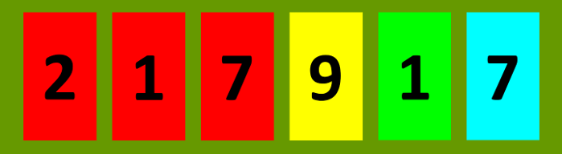

# Encoding of the Schotten Totten model.

This document presents how to encode the Schotten Totten model as a binary array to be stored in the database and passed between the different parts of the application over the network.

This encoding tries to offer a good compromise between concision, encoding and decoding performance and implementation simplicity.

## The model encoding

### The cards

The cards range from 1 to 9 and are colored with one of the following colors: red, yellow, blue, green, cyan and grey. There are 54 cards.

A card can therefore be represented with a byte.
 
We encode colors on using the 4 most significant bits and the numbers using the 4 least significant bits. 

| red | yellow | blue | green | cyan | grey |
|:---:|:------:|:----:|:-----:|:----:|:----:|
| 0x10|  0x20  | 0x30 | 0x40  | 0x50 | 0x60 |

Examples:
 *  the cyan card marked as 2 will be encoded `0x52`
 *  the red card marked as 7 will be encoded as `0x17`

 ### The board

The board is constituted by 6 row and 9 columns of card slots.

The board is divided in two: the first three rows are the game of the 
player that just played, the last three rows are the played cards of the player whose turn is next.

The board is encoded using on byte per slot corresponding to the card of the slot, from left to right and from top to bottom. If a slot is empty, then the it is encoded with `0x00`. The final encoding is a byte array of 54 bytes.

The board of the following figure is encoded as `0xffffffff42ffffffffffffffff28ffffffff3655ffff1413ffff68ff354422162669ffffff54ffffffffffffffffffffffffffffffff`. That is, if pretty printed:
```
ff ff ff ff 42 ff ff ff ff
ff ff ff ff 28 ff ff ff ff 
36 55 ff ff 14 13 ff ff 68 
ff 35 44 22 16 26 69 ff ff
ff 54 ff ff ff ff ff ff ff
ff ff ff ff ff ff ff ff ff
```



### A Hand
A hand is constituted of six slots and is encoded from left to right.

The hand of the following figure is encoded as `0x121117294157`.



### A Move
A move is encoded using one byte. The four most significant bits encode the position of the card in the hand to be played (starting at index 0, from left to right) and the four least significant bits bytes encode the column in which to play the card (starting with the left column indexed at 0)

The dummy move (that may be useful to encode the last play is represented using `0xff`.

Example: a move from the second card in the hand to the fourth column of the board is encoded as `0x13`.

### The deck

The deck is encoded as an array of byte using cards encoding. The deck is encoded from top to bottom.

### A turn

A turn is encoded as an array of bytes as follow:
| Byte Offset | Length | Chunk |
|:-----------:|:------:|:-----:|
|0| 6|the hand of the player that just played|
|6| 54| the board|
|60| 6| the hand of the player whose turn is next|
|66| 1| the length l of the deck |
|67| l | the deck 
|67 + l| 1 | the move of the next player|

### A match
An array of bytes containing all the turns in their chronological order. In order to encode the state of the board after the last move, we encode a turn with a dummy move 0xff.

## Specific usage.

### Database

Math are stored using the match encoding. Of course if the match is ongoing, the encoding is incomplete and contains only the turns that have been played so far.

#### Network

When the game manager is communicating over the network with players, players are sent the state of the game (so they don't have to maintain the state of the game) and must answer with a move (one byte only). The state of the game that is sent to them is incomplete (the game manager don't send them the information are not allowed to see). 

It is coded as follows:
| Byte Offset | Length | Chunk |
|:-----------:|:------:|:-----:|
|0|54|the board|
|54|6|the hand of the next player|

## Pending questions

* Why not encode a turn using the board state and hand state after the move instead of before the move?
* Should we order card in the board on each half?
* Can IA access to information that are hidden to player
* Think of concerning token stuff
* Should we reverse color and number in the card encoding? it would allow us to compare!
